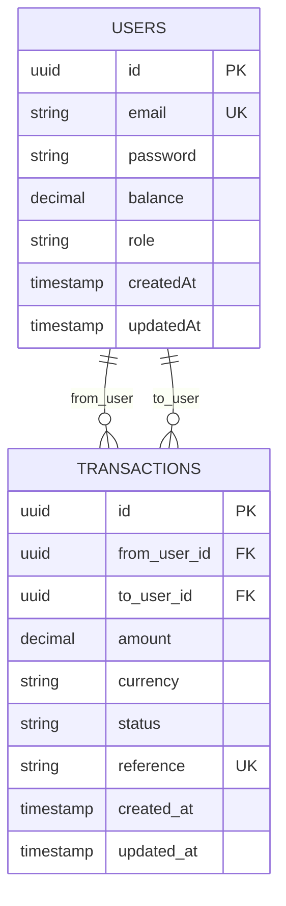

# Database Schema Diagram

## Entity Descriptions

### USERS

Tabla de usuarios del sistema.

| Column    | Type          | Constraints    | Description                     |
| --------- | ------------- | -------------- | ------------------------------- |
| id        | UUID          | PK             | Identificador único             |
| email     | VARCHAR       | UNIQUE         | Email del usuario               |
| password  | VARCHAR       | NOT NULL       | Password hasheada con bcrypt    |
| balance   | DECIMAL(20,2) | DEFAULT 0      | Balance monetario del usuario   |
| role      | VARCHAR       | DEFAULT 'user' | Rol del usuario (USER \| ADMIN) |
| createdAt | TIMESTAMP     | AUTO           | Fecha de creación               |
| updatedAt | TIMESTAMP     | AUTO           | Fecha de última actualización   |

### TRANSACTIONS

Tabla de transacciones monetarias entre usuarios.

| Column       | Type          | Constraints                | Description                      |
| ------------ | ------------- | -------------------------- | -------------------------------- |
| id           | UUID          | PK                         | Identificador único              |
| from_user_id | UUID          | FK → users.id              | Usuario que envía dinero         |
| to_user_id   | UUID          | FK → users.id              | Usuario que recibe dinero        |
| amount       | DECIMAL(20,2) | NOT NULL                   | Cantidad a transferir            |
| currency     | VARCHAR       | DEFAULT 'ARS'              | Código de moneda                 |
| status       | ENUM          | PENDING\|COMPLETED\|FAILED | Estado de la transacción         |
| reference    | VARCHAR       | UNIQUE                     | Referencia única anti-duplicados |
| created_at   | TIMESTAMP     | AUTO                       | Fecha de creación                |
| updated_at   | TIMESTAMP     | AUTO                       | Fecha de actualización           |

## Relationships

- **USERS → TRANSACTIONS (from_user)**: One-to-Many
  - Un usuario puede realizar muchas transacciones como emisor

- **USERS → TRANSACTIONS (to_user)**: One-to-Many
  - Un usuario puede recibir muchas transacciones como receptor
